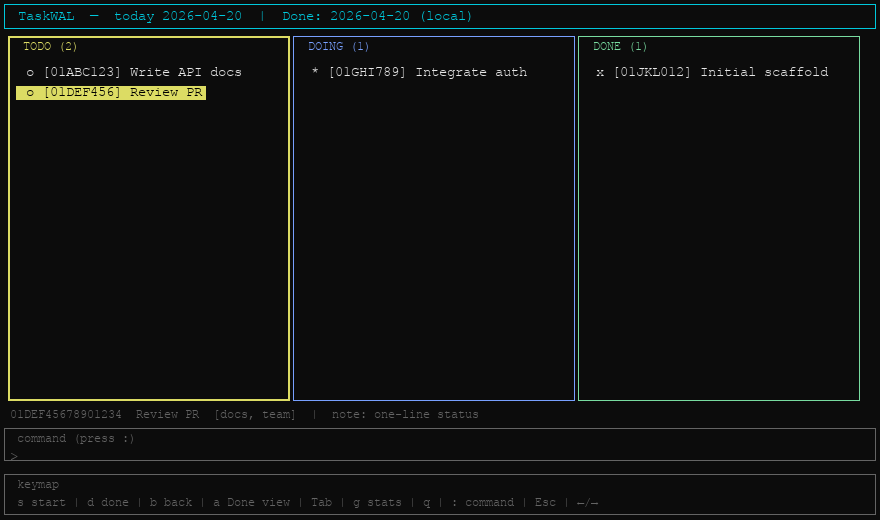
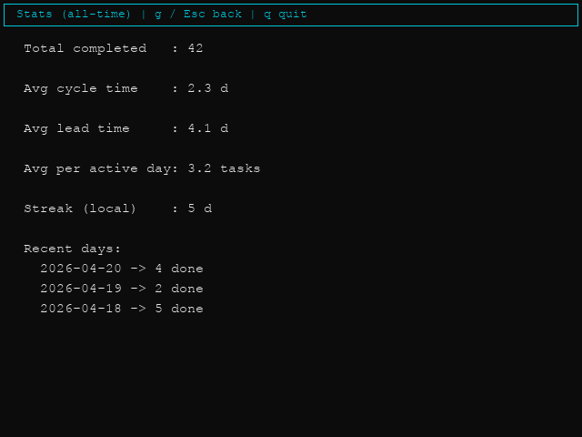

# TaskWAL (`tw`) — Kullanım Kılavuzu

Bu belge, projenin **mevcut sürümü** için komut satırı ve TUI kullanımını anlatır.

İngilizce aynı seviyede kılavuz: [USAGE.md](USAGE.md).

## Uygulama nedir?

TaskWAL, görevlerinizi **yerel bilgisayarınızda** tutan bir iş takip aracıdır. Tüm değişiklikler, silme dahil, **append-only** bir günlük dosyasına (WAL) yazılır; uygulama bu dosyayı okuyup güncel pano (Todo / Doing / Done) durumunu **yeniden oynatarak** (replay) üretir.

## Veri konumu


| Ortam         | Varsayılan dizin          | WAL dosyası |
| ------------- | ------------------------- | ----------- |
| macOS / Linux | `~/.taskwal/`             | `wal.log`   |
| Windows       | `%USERPROFILE%\.taskwal\` | `wal.log`   |


Özel konum için ortam değişkeni:

- **`TASKWAL_DIR`**: Veri klasörü. WAL yolu: `$TASKWAL_DIR/wal.log` (Windows’ta `%TASKWAL_DIR%\wal.log`).

## Kurulum ve `tw` komutu

Projeyi derledikten sonra:

```bash
cargo install --path /proje/yolu --force
```

Bu komut `tw` ikilisini genelde `~/.cargo/bin/tw` (Windows: `%USERPROFILE%\.cargo\bin\tw.exe`) altına kurar. Kabuğunuzda `cargo` PATH’i yüklü değilse:

```bash
. "$HOME/.cargo/env"   # macOS/Linux
```

Ardından her yerden `tw` çalışır. Güncelleme yaptıktan sonra yeniden `cargo install --path ... --force` çalıştırın.

Yardım:

```bash
tw --help
tw <komut> --help
```

---

## Günlük görünüm kuralları (`ls` ve `board`)

**Todo** ve **Doing** kolonları: Tamamlanmamış **tüm** görevler listelenir; oluşturuldukları güne bakılmaz. Dünden kalan açık iş ertesi gün de aynı kolonda görünür (carry-over).

**Done** kolonu:

- **Varsayılan:** Yerel saat diliminde **seçilen takvim gününde** tamamlanan görevler. Seçim belirtilmezse gün = **bugün**.
- **`--all`:** Tamamlanan **tüm** görevler (geçmiş dahil); Todo/Doing yine tüm açık işlerdir.
- **`--date YYYY-MM-DD`:** Done kolonu yalnızca o yerel güne düşen tamamlamalara göre süzülür.

`--all` ile `--date` **birlikte kullanılamaz.**

---

## Komutlar

### `tw add <başlık>`

Yeni görev ekler (varsayılan olarak Todo). Eklenme günü, o anki yerel tarih olarak kaydedilir.

```bash
tw add "API taslağını yaz"
tw add "Review" --tag backend,urgent
```

- **`--tag` / `-t`:** Virgülle ayrılmış etiket listesi.

### `tw start <id>`

Görevi **Doing** kolonuna taşır. İlk kez Doing’e geçişte “başlangıç” zamanı kaydedilir.

### `tw done <id>`

Görevi **Done** kolonuna taşır; tamamlanma zamanı kaydedilir.

### `tw back <id>`

Görevi **bir kolon geri** alır: Done → Doing → Todo (uygun olduğunda).

### `tw edit <id> <yeni başlık>`

Başlığı günceller.

### `tw note <id> <metin>`

Göreve not ekler (geçmiş notlar korunur).

### `tw rm <id>`

Görevi panodan kaldırır (WAL’a `Delete` olayı yazılır).

### Görev kimliği (`id`)

Tam ULID veya **benzersiz olduğu sürece önek** kullanılabilir (ör. ilk 8 karakter). Birden fazla görevle eşleşirse veya hiçbiriyle eşleşmezse hata verir. Boş önek kullanılamaz.

### `tw ls`

Metin panosu: Todo / Doing / Done listesi.

```bash
tw ls
tw ls --all
tw ls --date 2026-04-01
```

### `tw board`

Terminal içi **Kanban** panosu (Ratatui). `ls` ile aynı görünüm seçenekleri:

```bash
tw board
tw board --all
tw board --date 2026-04-01
```



**Seçili kolon** kenarlığı vurgulanır. **Seçili satır**, o kolonun **vurgu rengiyle** (sarı / mavi / yeşil) aynı arka plan ve kalın yazı ile gösterilir (sarı ve yeşilde siyah, mavi üzerinde beyaz metin).

**Komut** kutusunun üstünde, tek satırlık bir **durum** şeridi komut çıktısı yokken **seçili görevi** gösterir (kimlik, başlık, etiketler, notlar); kolonda kesilen uzun metinler burada okunabilir; satır terminal genişliğine göre kısaltılabilir. `:` ile bir komut çalıştırdıktan sonra şerit, sonuç veya hatayı **Tab**, ok tuşları veya başka bir gezinme tuşuna basana kadar gösterir.

**Klavye (board ekranı):**


| Tuş       | İşlev                                                                  |
| --------- | ---------------------------------------------------------------------- |
| `Tab`     | Kolon değiştir (Todo → Doing → Done)                                   |
| `↑` / `↓` | Seçili kolonda satır                                                   |
| `s`       | Seçili görevi Doing’e al                                               |
| `d`       | Seçili görevi Done’a al                                                |
| `b`       | Seçili görevi bir kolon geri al (Done→Doing→Todo)                      |
| `a`       | Done kolonu: bugünün tamamlananları ↔ tüm tamamlananlar arasında geçiş |
| `g`       | İstatistik ekranına geç                                                |
| `q`       | Çıkış                                                                  |
| `:`       | Komut satırı (aşağıya bakın)                                           |
| `Esc`     | Komut satırında iptal                                                  |

**`s`**, **`d`** veya **`b`** ile taşıdıktan sonra aynı görev seçili kalır ve yeni kolonunda vurgulanır (güncel görünümde hâlâ listeleniyorsa).

**Komut satırı (`:`):** Örneğin `add Yeni görev` veya `start 01ABC123` yazın (`tw` öneki isteğe bağlı). **Enter** ile çalıştırın, **Esc** ile iptal. Düzenlerken imleci **←** / **→** ile taşıyın.

**İstatistik ekranı:**


| Tuş        | İşlev           |
| ---------- | --------------- |
| `g`, `Esc` | Board’a dön     |
| `q`        | Uygulamadan çık |


Yeni görev **CLI** ile eklenir: `tw add "…"`.

### `tw stats`

**Tüm zamanlar** için özet (tamamlanan görevlere göre):

- Toplam tamamlanan iş sayısı  
- Ortalama **cycle** süresi (gün): ilk başlangıç veya oluşturma → tamamlanma  
- Ortalama **lead** süresi (gün): oluşturma → tamamlanma  
- Aktif gün başına düşen ortalama tamamlanan iş  
- Yerel günlere göre **streak** (ardışık günler)  
- Son günlerin kısa dökümü  

`tw board` içindeki tam ekran istatistik görünümü:



### `tw log`

Ham WAL satırlarını JSON olarak yazdırır (yedekleme veya hata ayıklama için).

---

## Örnek bir gün

```bash
tw add "Sabah toplantısı"
tw add "PR incelemesi" --tag code

tw ls
tw start 01ABC123
tw done 01ABC123

tw stats
tw board
```

---

## Windows notları

- **Derleme:** Windows’ta `cargo build --release` çıktısı `target\release\tw.exe` olur; dağıtım için bu dosyayı kullanın.
- **Terminal:** Windows Terminal veya güncel bir konsol önerilir; TUI çoğu ortamda çalışır.

---

## Lisans

Proje `Cargo.toml` içinde belirtildiği gibi (ör. MIT OR Apache-2.0).